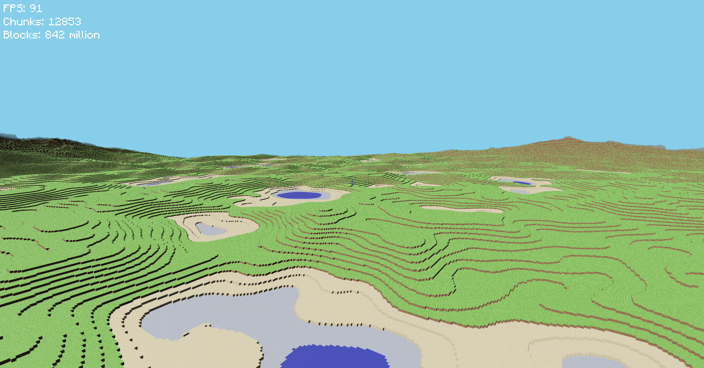

# Minecraft Rust (Bevy)

  
  

## Overview & Performance

This project is a highly optimized Minecraft clone written in **Rust** using the **Bevy Engine**. While it is not a fully playable game yet, the core systems (chunk generation, greedy meshing, and saving/loading) are fully implemented and extremely fast.

As seen in the previews above, the engine is capable of generating terrain seamlessly as you fly, maintaining **90+ FPS** even with over **12,000 chunks** (or **840 million blocks**) loaded simultaneously. 

> Note: This benchmark was captured on a heavily thermally-throttled 2020 HP laptop with an 8-core Intel i7 CPU and a low-end GPU (MX450 with 2Gb VRAM), which demonstrates the engine's efficiency under severe hardware constraints.

This level of performance was achieved by:
1. Building highly specific, memory-dense data structures rather than relying blindly on generalized ECS patterns.
2. Completely offloading terrain generation and meshing to background asynchronous tasks.
3. Radically reducing memory overhead by storing world modifications as a sparse difference map rather than saving the entire world state.
4. Using Bevy natively only for rendering, UI, and system scheduling, while the entire voxel architecture was built from the ground up with performance in mind.

---

## Architecture

While Bevy provides an excellent Entity Component System (ECS), representing every single block as an Entity would quickly bring the CPU and RAM to their knees. To solve this, the engine operates on a hybrid architecture:

* **[The ECS Layer](src/main.rs):** Handles the game loop, state transitions, rendering cameras, and UI updates.
* **[The Data Layer](src/chunks.rs#L10-L16):** Chunks are pure data structures containing flat 1D arrays of blocks. They exist entirely outside the ECS until they are fully processed and ready to be rendered as a single `Mesh3d`.

By treating chunks as monolithic blocks of data, we maintain CPU cache locality and bypass the overhead of managing millions of entities.

---

## Optimizations

Achieving 840+ million blocks running at 90+ FPS required a strict approach to memory and CPU optimizations.

### 1. [1D Flat Arrays for Chunk Data](src/chunks.rs#L10-L16)
Instead of using nested 3D arrays or `HashMap`s for chunk volume data, each chunk stores its `16x256x16` blocks in a single, contiguous 1D array (`[BlockType; 65536]`). This guarantees perfect CPU cache locality during chunk generation and meshing, drastically reducing cache misses.

### 2. [Asynchronous Pipeline: Generation & Meshing](src/world.rs#L52)
Terrain generation and mesh construction are entirely decoupled from the main thread to ensure the game never stutters. The pipeline operates in a seamless sequence:
* **Distance-based Queuing:** The [`manage_chunk_loading`](src/world.rs#L52-L215) system monitors the camera's position. It calculates the exact chunks needed and prioritizes them radially, starting from the chunk directly under the player and expanding outward. This ensures the terrain fills in seamlessly around you as you move.
* **Procedural Generation:** Enqueued chunks are dispatched to an `AsyncComputeTaskPool`. Here, the 1D arrays are populated block-by-block using deterministic noise functions driven by the world's seed (see [`load_raw_chunk`](src/chunks.rs#L287-L380)).
* **Greedy Meshing:** Once the raw block data is generated, a second background task mathematically constructs the optimal 3D mesh (see [`mesh_chunk`](src/meshing.rs#L115-L270)).
* **Mounting to Bevy:** The main thread simply sweeps up these completed meshes and mounts them to the Bevy renderer (see [`process_chunk_mesh_tasks`](src/world.rs#L296-L340)). The main thread never blocks or calculates terrain, allowing the game to maintain a flawless framerate.

### 3. [Intelligent Face Culling & Meshing](src/meshing.rs#L115)
Minecraft chunks are incredibly dense. To prevent the GPU from rendering millions of internal, invisible faces:
* The meshing algorithm strictly checks neighboring blocks before generating a face.
* It distinguishes between `Opaque` and `Transparent` (water, leaves) geometry to correctly cull faces without breaking visual rendering.
* Heightmaps are pre-calculated to allow the meshing algorithm to skip massive volumes of empty air (`min_face_height` and `max_face_height`).

### 4. [Frustum Culling (Letting Bevy do what it does best)](src/world.rs)
Rather than manually calculating visibility using dot-products and mutating visibility components every frame, we rely entirely on Bevy's native, highly optimized spatial hierarchies. Bevy automatically computes the AABB (Axis-Aligned Bounding Box) for our chunk meshes and culls them perfectly on the GPU.

---

## Game Saving & Data Persistence

A naive save system would dump the entire `[BlockType; 65536]` array for every loaded chunk to disk. For 12,000 chunks, that would be gigabytes of data.

Instead, the save system employs a **Delta Storage / Sparse Matrix approach**:

### 1. [Seed-based Determinism](src/chunks.rs#L287)
The core terrain is entirely deterministic. The world relies solely on a `u32` seed. Because the terrain math will always produce the exact same result for a given chunk coordinate and seed, we *never* save the base terrain to disk.

### 2. [Sparse Modification Map](src/saves.rs#L11-L24)
* When a player breaks or places a block, the change is recorded in a sparse `HashMap` linking the exact 1D index of the chunk to the new `BlockType`.
* When saving the game, we serialize *only* these delta modifications (currently using `serde_json` for debugging readability, but architected to be easily swapped with a zero-allocation binary format like bincode for production).
* When loading a chunk, we generate the deterministic base terrain from the seed, and then simply overwrite the modified indices using the delta map.

### 3. State Preservation
Alongside the delta map, the [`SaveFile` struct](src/saves.rs#L11-L24) seamlessly persists the user's explicit state, including the exact camera location (`x, y, z`), and rotation (`yaw, pitch`), allowing players to drop right back into the action.